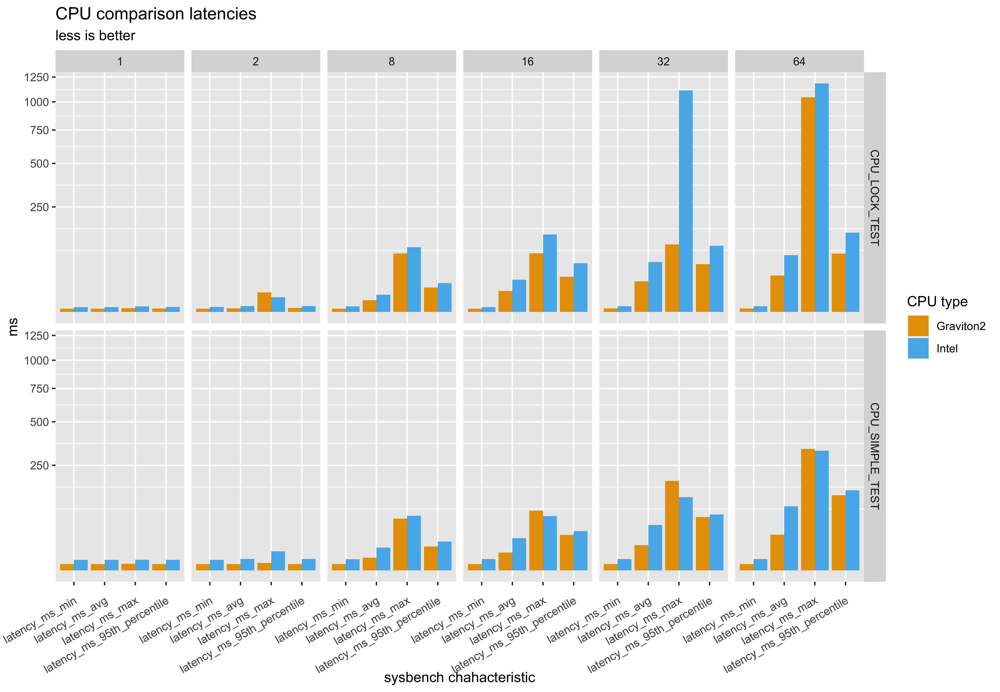
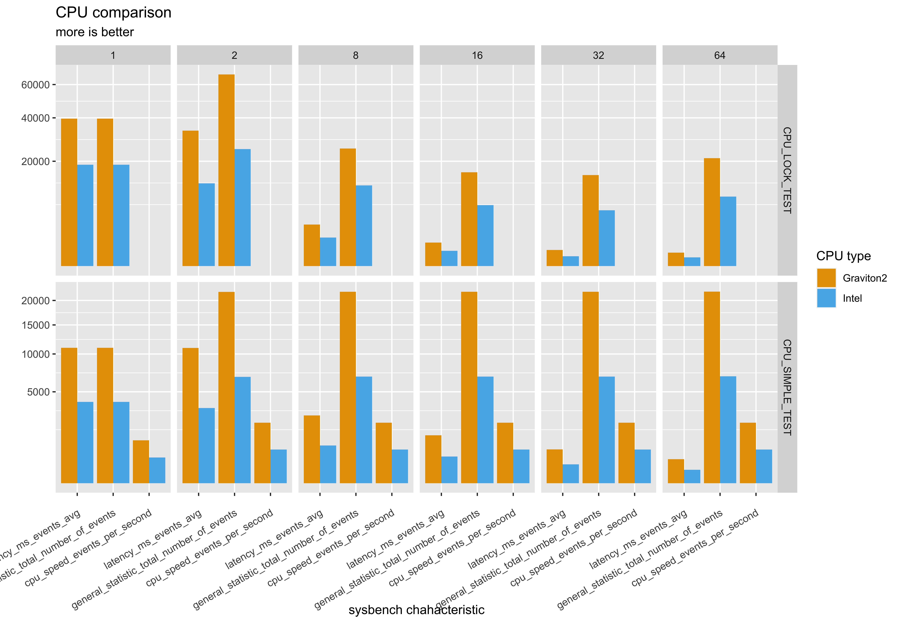
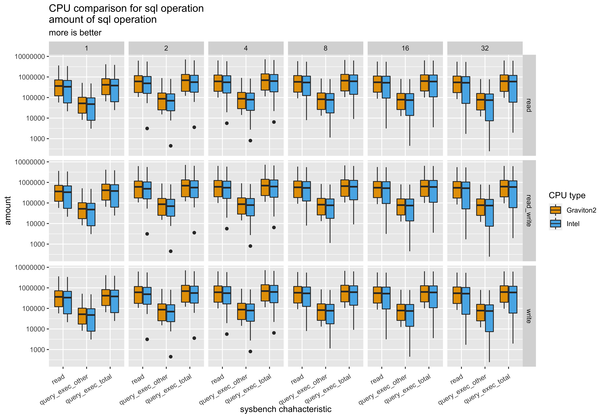
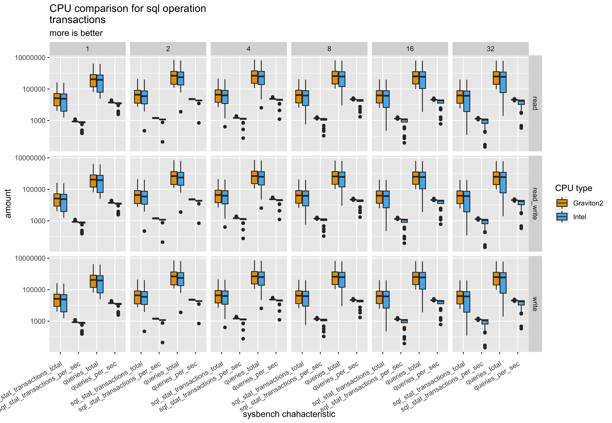
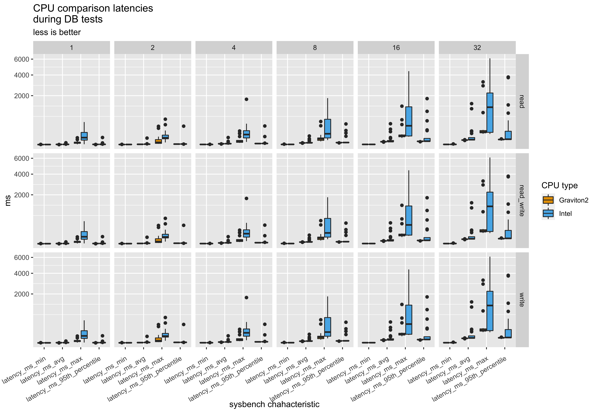
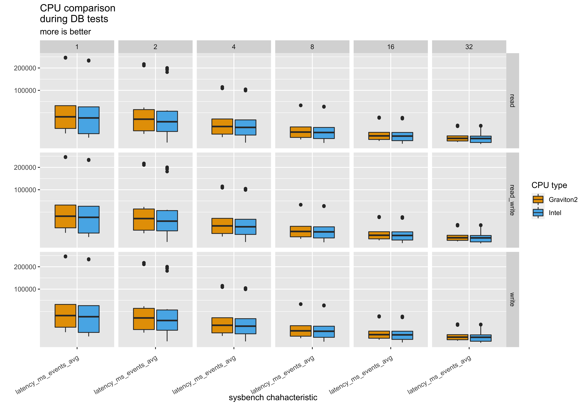

# cpu_benchmark_with_sysbench
this is small research task to collect data for comparing cpu performance.

# Main description
there are 3 main steps:
1. Prepation your VM for testing
1.1. install sysbench
1.2. install mySql
1.2.1. configure mysql db
1.2.2. create new test db
2. run the test on VM
3. collect logs and generate data.table ready for analysis and comparasion

##### important note:
> examples would be provided for sysbench 1.0.18
> instalation examples were prepared on ubuntu 20
> you should know how to use next utilities: ssh, scp, 
> you should have "*.pem" file for each your machine

# Preparation 
1.1. lets install sysbench 
and its neccessary drivers for mySql

```bash
sudo apt-get update -y
sudo apt-get install -y sysbench
sudo apt -y install libmysqlclient-dev libssl-dev
```

1.2. next step is install and configure mySql server

```bash
sudo apt-get install mysql-server
```

1.2.1. with next utility it is need to configure root password for mySql
```bash
sudo mysql_secure_installation utility
```
> ** remember root password -- it will be used in next steps **

1.2.2. next step is creating new DB for testing. 
by default it is recommended to create db called `<sbtest>`. it is default db name for sysbench. in other case be awere to remember db name for next steps.

```bash
sudo mysql -u root -p
```
```sql
mysql> create database sbtest;
mysql> exit
```

# Running test. 

you can you any configuration of sysbench tests. However we already prepare script for you. 
run `run_test.sh` and wait. 

```bash
./run_test.sh -u root -p "your_root_password" -d sbtest
```

keys for `run_test.sh`:
> -u -- (mandatory) user name for connecting to mySql DB. mandatory.
> 
> -p -- (mandatory) user password for connecting to mySql DB.
> 
> -d -- (optional. Default - sbtest) target database for tor testing
> 

by default test result logs will be storred and folder `logs` (created automatically same folder with `run_test.sh`).
After each iteration logfiles would be reloaded.

##### helpful note:
there could be some problem how to run it on remote machihe where `run_test.sh` does not exist. 
reccomendation: use scp for upload script there.

```bash
scp -i path/your_ssh_key.pem -r /Users/YOUR_USER/path/run_test.sh ubuntu@remote_host:/home/YOUR_REMOTE_USER/
```


# Collect logs

for collecting logs it is reccomended to use `scp`
and store it in different places from each tested server.

```bash
scp -i path/your_ssh_key.pem -r ubuntu@remote_host:/home/%YOUR_REMOTE_USER%/logs /Users/%YOUR_USER%/logs/%unique_seerver_name%
```


# Generating data.table for analysis.
> for this action you should have some `R` knowledge.

Inside `analysis.R` you would need to setup root folder to your logs `/Users/%YOUR_USER%/logs/` and run full script. 
as result script would read all logs in folder and parse it to one data.table structure for furcther analysis.
in next step it would prepare pictures for comparing


# Examples of comparing result:
plot grid:
rows -- Test names
columns -- Number of threads during tests
#### CPU test






#### DB test











